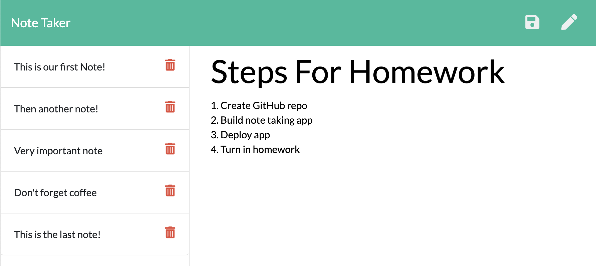

  
  # No Sweat Notes

  No Sweat Notes is a quick and simple note keeper that allows you to quickly take and save notes for future reference then easily delete them after they're no longer needed.
  [You can view deployed app at this link:](https://no-sweat-notes.herokuapp.com/ "View No Sweat Notes App") https://no-sweat-notes.herokuapp.com/

## Table of Contents
- [Usage](#How-to-use)
- [Languages](#Languages-and-Lessons)
- [Contribute](#How-to-contribute)
- [Questions](#Developed-by)
- [Credits](#Acknowledgments-and-Credits)
- [License](#Licensed-under-MIT)

## How to use
The app is very easy to use. [Visit this link](https://no-sweat-notes.herokuapp.com/ "View No Sweat Notes App") and start typing your first notes! When your note is complete, simple click the save icon in the top right corner. To view notes, click their title in the left hand list. When you're ready to delete a note, simply click the trashcan icon near the title!

## Languages and Lessons
The exercises in this project focussed on learning Express, routes, and some work with separating concerns. There was quite a bit of research in the Express docs needed to help find the solutions that brought this app to completion. Accessing the parameters added at the end of the URLs to delete notes took some time since the syntax I assumed would provide that information was not correct, the docs and my fellow students helped me locate the correct solution.

## How to contribute
If anyone would like to improve the app by contributing, they're welcome to submit a pull request on [GitHub](https://github.com/keiththarp/no-sweat-notes).

## Developed by
- Keith Tharp

Please reach out with questions at:
  - keithstharp@gmail.com

Find more of Keith Tharp's work at:
  - https://github.com/keiththarp

## Acknowledgments and Credits
Thank you to all my fellow students and study groups that helped and supported with this homework project!

## Licensed under MIT
[Click here for more information on the MIT license.](https://choosealicense.com/licenses/mit/)
